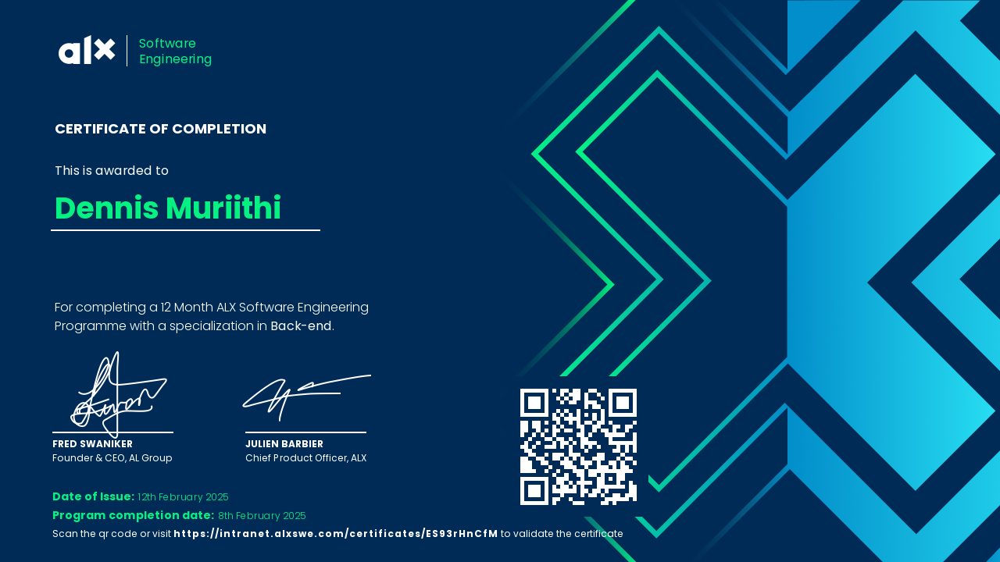

<!-- CYBER WAVE -->

<p align="center">
  
</p>

---

## 👾 PROFILE

<p align="center">


<br/>

<p align="center">
<span style="color: #00FF41; font-family: 'Courier New', monospace; font-size: 16px; font-weight: bold;">
▸ <i>Offensive Security</i> | <i>Reverse Engineering</i> | <i>Production Infrastructure</i>
</span>
<br/>
<span style="color: #AAAAAA; font-family: 'Courier New', monospace; font-size: 14px;">
Building unbreakable systems by breaking them first | Red Team | CTF | Zero-days
</span>
</p>

</p>

---

## ⚙️ TECH MATRIX

<p align="center">


<br/><br/>


<br/><br/>


<br/><br/>


</p>

---

## 📊 SYSTEM METRICS

<p align="center">

  <!-- GitHub Stats -->
  

  <br/><br/>

  <!-- Streak Stats -->
  

  <br/><br/>

  <!-- Top Languages -->
  

</p>

---

## 📡 LIVE DATA STREAM

<p align="center">
  
</p>

---

## 🧾 CERT VAULT

<p align="center">
  
</p>

---

## 🌐 NETWORK

<p align="center">

<a href="https://github.com/19Gray">
  
</a>

<a href="https://linkedin.com/in/19Gray">
  
</a>

<a href="https://muriithi-portfolio.vercel.app/">
  
</a>

</p>

---

## ⚡ EXECUTION LOOP

<p align="center">

```rust id="sbq0tp"
loop {
    build();
    exploit();
    secure();
}
